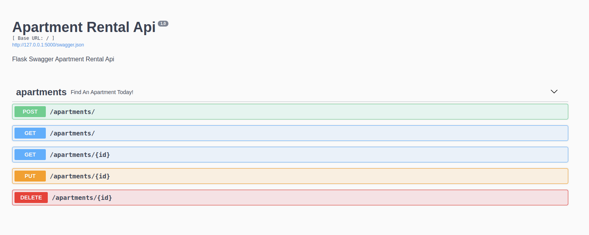

## flask-restApi

## Structure
```
├── app.py
├── Pipfile
├── Pipfile.lock
└── README.md
```

## API Endpoints

#### /apartments
* `GET` : Get all apartments
* `POST` : Create an apartment listing

#### /apartments/:id
* `GET` : Get a apartment listing
* `PUT` : Update a apartment listing
* `DELETE` : Delete a apartment listing



